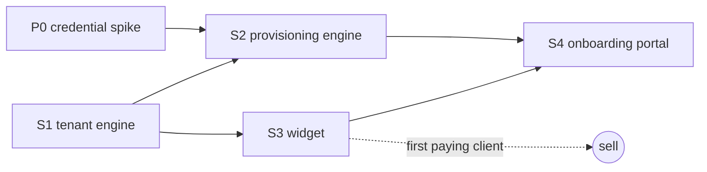
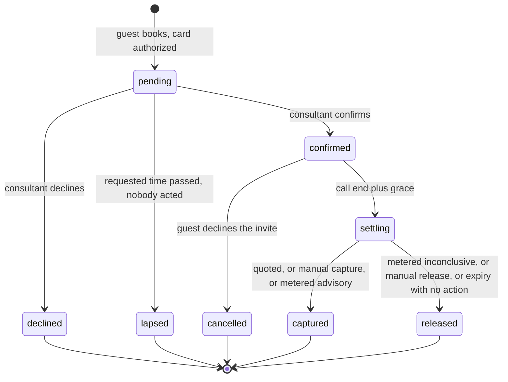

# Consults 2.0: a deployable booking module

Status: design, 2026-08-18. Nothing in here is built. 1.0 is the single-tenant system
running live on `nlma.io` as n8n workflow `R0cMmqeBshPYpdqt`.

## What this is

1.0 is one consultant's booking system with that consultant's name, calendar, rate, and
Stripe account welded into it. 2.0 is the same behaviour delivered as a module that can be
stood up for any consultant or attorney, hosted by NLMA, one isolated instance per client.

The behaviour worth keeping is specific and unusual, and it is the reason there is a product
here at all:

- The card is authorized at booking and never charged at booking.
- The consultant reviews every request. The calendar hold is tentative until they confirm.
- The booking window is 21 days, longer than a Stripe authorization survives, so the hold is
  renewed against the saved card before it lapses.
- Nothing settles silently. Every terminal state sends the guest an email that says what
  happened to their money.

## Decisions locked

| Question | Decision | Consequence |
|---|---|---|
| Delivery | NLMA hosts, one isolated n8n workflow per tenant | A bad credential or a bad edit can only reach one tenant's money |
| Booking surface | Embeddable widget on the tenant's own site | Needs a public config endpoint and per-tenant CORS |
| Capture | Three policies, transcript billing opt in | Recording consent stops being a precondition for every sale |
| Payments | Tenant's own Stripe account, restricted key | NLMA is never in the payments chain. No Connect build, no platform KYC |
| Booking store | Postgres on the VPS | Survives redeploys, queryable, real dispute evidence |
| Provisioning | Self serve onboarding portal | Largest new build, and it rests on an unproven credential mechanism |
| 1.0's fate | `nlma.io` migrates onto 2.0 as tenant zero | NLMA runs what it sells, so every bug arrives here before it reaches a client |

## Five sub-projects, in order

Each gets its own spec and its own implementation plan. This document is the architecture
they share.

| # | Sub-project | Blocks | Why in this position |
|---|---|---|---|
| P0 | Credential spike | S2, S4 | Can invalidate the portal design. Cheap to answer |
| S1 | Tenant engine | everything | Config seams, three capture policies, Postgres store |
| S2 | Provisioning engine | S4 | Headless render, import, credential creation, tenant seed |
| S3 | Widget | S4 | First client facing surface. A paying client is possible here |
| S4 | Onboarding portal | none | Removes NLMA from the loop. Pure convenience, so it goes last |



Code lands in a new repo, `NextLevelManagementAdvisors/consults-module`: the workflow
template, the migrations, the widget, the provisioning engine, and later the portal. This
design document stays here with the rest of the consult specs for continuity.

---

# The central structural decision

**One workflow template, identical for every tenant, with configuration read from Postgres
at runtime.**

The obvious approach is to bake each tenant's rate, calendar, and branding into their copy
of the workflow. Do not. It means every configuration change is a redeploy, every redeploy
is a chance to fat finger someone's rate, and shipping a fix to twelve tenants means twelve
renders that have all drifted from the template.

Instead, exactly three things vary per instance:

1. `TENANT_KEY`, a single constant substituted into a Config node.
2. Credential ids. Three are always per tenant: Stripe, Google Calendar, Gmail. A `metered`
   tenant adds a fourth, the Drive plus Docs service account that reads the notes doc. The
   judge endpoint credential is NLMA's own and is shared, not provisioned per tenant, which
   is itself a disclosure question. See open question 3.
3. Webhook paths, suffixed with the tenant key because n8n requires unique paths across
   active workflows.

Everything else, every rate and duration and business hour and email signature, is a row in
Postgres that the workflow reads on each execution. A tenant changing their rate is an
UPDATE. Shipping a bug fix to every tenant is one template render per tenant with no config
to preserve.

## Config node

First node after every trigger. Reads the tenant row, fails loudly if the tenant is missing
or suspended, and puts the config on every downstream item.

```
SELECT config FROM tenants WHERE tenant_key = 'TENANT_KEY' AND status = 'active'
```

A missing or suspended tenant must throw, not default. A booking flow that silently fell
back to default pricing would charge the wrong amount.

---

# Tenant configuration

The seam list. Anything not here is not configurable, on purpose.

## Identity and branding

| Key | Example | Notes |
|---|---|---|
| `display_name` | Hardesty Law PLLC | Appears in emails and on the widget |
| `from_name` | Ellis Hardesty | Email sender name |
| `reply_to` | ellis@hardestylaw.com | Where a guest reply goes |
| `bcc` | ellis@hardestylaw.com | Copy of every guest email, as 1.0 does |
| `brand_color` | `#1c3f5e` | Widget accent only. No full theming in 2.0 |
| `logo_url` | https://... | Optional, widget header |
| `terms_url` | https://hardestylaw.com/consult-terms | Linked at the card step. Tenant supplies their own |

## Calendar and availability

| Key | Example | Notes |
|---|---|---|
| `calendar_id` | ellis@hardestylaw.com | The calendar that is read and written |
| `timezone` | America/Chicago | IANA. All slot maths and every displayed label |
| `hours` | `{mon:[["09:00","17:00"]], ...}` | Per weekday, multiple ranges allowed |
| `window_days` | 21 | How far ahead booking is open |
| `min_lead_hours` | 12 | No booking inside this window |
| `slot_granularity_min` | 30 | Grid spacing |
| `blackout_dates` | `["2026-09-07"]` | Holidays. 1.0 needed this for Labor Day and did not have it |

## Offerings

An ordered list. This replaces 1.0's hardcoded free intro plus billable split.

```
offerings: [
  { key:"intro", label:"Introductory call", duration_min:15, amount:0,
    authorize:112.50, billable:false },
  { key:"30", label:"Consultation", duration_min:30, amount:225.00, billable:true },
  { key:"60", label:"Extended consultation", duration_min:60, amount:450.00, billable:true }
]
```

`amount` is what the guest is quoted. `authorize` is what is held, and it defaults to
`amount` for a billable offering. A free intro quotes nothing and still holds something,
which is exactly 1.0's behaviour and is the thing that makes a free intro safe to offer.

## Policy

| Key | Default | Notes |
|---|---|---|
| `capture_policy` | `quoted` | `quoted`, `manual`, or `metered` |
| `reauth_after_days` | 6 | Renew the hold on day six |
| `grace_min` | 45 | Wait after the call before settling |
| `min_real_call_sec` | 120 | Metered only. Under this is not a consultation |
| `judge_min_confidence` | 0.7 | Metered only |
| `rate_per_hour` | 450 | Metered only |
| `increment_min` | 15 | Metered only |
| `recording_consent_disclosure` | false | Forced true when policy is `metered` |
| `allowed_origins` | `["https://hardestylaw.com"]` | CORS for the widget endpoints |

## What is deliberately not configurable

These are the product's promises. Making them switches makes the product incoherent and the
disclosures unfalsifiable.

- The card is authorized, never charged, at booking.
- A capture never exceeds the amount authorized.
- An inconclusive settlement releases rather than captures.
- The calendar hold is tentative until the consultant confirms.
- Every terminal state emails the guest.

---

# Capture policies

1.0 has exactly one settlement path and it depends on a Gemini transcript. That path is
excellent and it is also the single largest obstacle to selling this to a lawyer, because it
requires recording the call. In two party consent states, including California, Florida,
Pennsylvania, Illinois, Washington, and Massachusetts, that requires every participant's
consent, and privilege questions sit on top of the consent question.

So the module ships three policies and the transcript path becomes the one you opt into.

## `quoted`, the default

At call end plus `grace_min`, verify the PaymentIntent is still `requires_capture`, capture
the amount authorized, settle, and email both sides. The consultant's receipt carries a
refund link.

The semantics are honest and easy to write into terms: you booked the time, the time was
held for you, you are billed for it. No recording, no Drive credential, no Gemini
dependency, nothing to disclose beyond the fee itself.

## `manual`

At call end plus `grace_min`, email the consultant a settle link carrying an amount box
prefilled with the authorized amount. Nothing moves until they act.

The rule that makes this safe: **if the consultant never acts, the hold is released rather
than left to expire, and the guest is told.** A hold that dies quietly on a guest's card
because a consultant ignored an email is the worst outcome this system can produce.

Concretely, the deadline is the authorization's own clock, not a policy invention. The
re-auth sweep already renews a hold on day six because a Stripe authorization does not
survive seven. An unsettled `manual` booking is not renewed: the same sweep releases it once
the authorization is inside 24 hours of lapsing, writes the settlement, and emails both
sides. The consultant therefore has from call end plus `grace_min` until roughly six days
after the authorization was last taken, which for a same week booking is days rather than
hours. The lapse branch in 1.0 already implements this shape for unconfirmed requests, so the
machinery exists.

## `metered`

1.0's behaviour, unchanged: find the Gemini notes doc, read measured talk time, judge intro
against advisory work, bill in `increment_min` blocks at `rate_per_hour`, capped at the
amount authorized, and release on anything inconclusive.

Provisioning refuses this policy unless `recording_consent_disclosure` is true, and setting
that flag injects the consent language into the booking flow and the confirmation email. The
tenant is asserting they have a lawful basis to record. The module makes the assertion
explicit rather than implied.



Every terminal state releases or captures explicitly. There is no path where a hold simply
stops being tracked.

---

# Postgres store

Replaces `$getWorkflowStaticData('global')`. Static data is a JSON blob on the workflow row:
it dies with the workflow, grows without bound, cannot be queried, and can be raced by
concurrent executions. All four are tolerable for one consultant and none are tolerable for a
product that redeploys workflows routinely and holds other people's money.

```sql
CREATE TABLE tenants (
  tenant_key    text PRIMARY KEY,
  display_name  text NOT NULL,
  status        text NOT NULL DEFAULT 'active',   -- active | suspended
  config        jsonb NOT NULL,
  workflow_id   text,
  created_at    timestamptz NOT NULL DEFAULT now()
);

CREATE TABLE bookings (
  tenant_key      text NOT NULL REFERENCES tenants(tenant_key),
  token           text PRIMARY KEY,
  status          text NOT NULL,   -- pending|confirmed|declined|cancelled|lapsed|captured|released
  offering_key    text NOT NULL,
  start_iso       timestamptz NOT NULL,
  duration_min    int NOT NULL,
  name            text NOT NULL,
  email           text NOT NULL,
  phone           text,
  request         text,
  amount          numeric(10,2) NOT NULL,   -- authorized
  billable        boolean NOT NULL,
  payment_intent  text,
  customer_id     text,
  payment_method  text,
  event_id        text,
  settled_at      timestamptz,
  reauthorized_at timestamptz,
  nudged_at       timestamptz,
  created_at      timestamptz NOT NULL DEFAULT now()
);

CREATE TABLE settlements (            -- append only, never updated
  id          bigserial PRIMARY KEY,
  tenant_key  text NOT NULL,
  token       text NOT NULL,
  action      text NOT NULL,          -- capture | release
  amount      numeric(10,2) NOT NULL,
  authorized  numeric(10,2) NOT NULL,
  reason      text NOT NULL,
  evidence    jsonb,                  -- talk time, doc id, judge verdict
  created_at  timestamptz NOT NULL DEFAULT now()
);

CREATE TABLE holds (
  tenant_key     text NOT NULL,
  slot_start_iso timestamptz NOT NULL,
  token          text NOT NULL,
  status         text NOT NULL         -- held | released
);

CREATE UNIQUE INDEX holds_one_live_per_slot
  ON holds (tenant_key, slot_start_iso) WHERE status = 'held';

CREATE INDEX bookings_due ON bookings (tenant_key, status, start_iso);
```

Two things this buys beyond durability.

**The double booking race becomes a database constraint.** 1.0 checks FreeBusy, then checks
static data, then writes. Two guests hitting the same slot in the same second can both pass.
`holds_one_live_per_slot` turns that into an insert that fails, which the checkout flow
already knows how to turn into a 409.

**`settlements` is dispute evidence.** Append only, one row per money movement, carrying the
reason string that was shown to the guest and the evidence it rested on. When a guest
disputes a charge four months later, that row is the answer.

## Migrating the live tenant

`nlma.io` becomes tenant `nlma`, the first instance of the module and the one that catches
every bug before a paying client does.

**Do this while the register is empty.** There are currently zero confirmed bookings in the
live register, so the migration is an empty table plus a config row rather than a data
migration with money in flight.

### Cut over by starving 1.0, never by editing it

The instinct is to upgrade `R0cMmqeBshPYpdqt` in place. Do not. It is holding real
authorizations, and an in place rewrite of 111 nodes has no rollback that does not involve
restoring a workflow by hand while a guest's card is held.

Instead the two systems coexist and traffic moves between them, which is the same blue and
green shape the VPS reconciler already uses for Docker services:

1. Create the schema and the `nlma` tenant row. Nothing is live yet.
2. Deploy the 2.0 template as a **new** workflow with its own webhook paths, suffixed
   `-nlma`. 1.0 is untouched and still serving.
3. Point `consults.html` at the new paths. This is the cutover, and it is a one line change
   to a static page.
4. Rename 1.0's webhook paths to `-retired-<date>`, the same move L4 already used to kill
   `consult-book`. 1.0 is now inert but intact, and its static data register still holds
   whatever it held.
5. Watch one real booking travel the whole way: authorize, confirm, calendar invite, settle.
6. Delete 1.0 only after a consult has actually settled on 2.0.

**Rollback is step 3 in reverse.** Point the page back at the old paths and rename 1.0's
webhooks live again. Because 1.0 was never edited, its register is exactly as it was, and
nothing needs to be restored. The window where a booking could land in one system and settle
in the other is the seconds between steps 3 and 4, and it is closed entirely by doing the
cutover when no consult is pending.

The one thing this does not cover is a booking taken by 1.0 that has not yet settled when
step 4 runs. Today that set is empty. If it is ever not empty, 1.0 stays active with its
webhooks retired, so its crons keep sweeping its own bookings to completion while 2.0 takes
all new traffic, and 1.0 is deleted when its last booking settles.

---

# Widget and the config endpoint

The tenant pastes two lines into their own site.

```html
<script src="https://consults.nlma.io/w.js" data-tenant="hardesty-law"></script>
<div id="nlma-consults"></div>
```

The widget boots, fetches its tenant's public config, and renders the calendar and card flow
inline. 1.0's `consults.html` is 713 lines of exactly this flow and becomes the widget's
starting point.

## `GET /webhook/consult-config?t=<tenant_key>`

The only new endpoint. Returns the public subset of config, and nothing else:

```json
{ "display_name":"Hardesty Law PLLC", "from_name":"Ellis Hardesty",
  "brand_color":"#1c3f5e", "logo_url":null, "terms_url":"https://...",
  "timezone":"America/Chicago", "window_days":21, "min_lead_hours":12,
  "currency":"usd", "consent_notice":null,
  "offerings":[{"key":"intro","label":"Introductory call","duration_min":15,
                "amount":0,"authorize":112.50,"billable":false}] }
```

`tenant_key` is public by construction: it sits in the page source of the tenant's own site.
It is a name, not a secret, and nothing may be authorized by holding one. Every write
endpoint keeps 1.0's guard: the honeypot field, rate limiting, and server side recomputation
of the amount. **The widget never sends a price.** It sends an offering key and the backend
looks up what that costs, which is the same discipline 1.0 already uses in Checkout Compute.

## CORS

Each write endpoint echoes `Access-Control-Allow-Origin` only for an origin present in that
tenant's `allowed_origins`. An unknown origin is refused rather than reflected.

## Subresource integrity, and why the loader does not use it

A script tag without an `integrity` hash trusts whatever the host serves. The usual advice is
to pin the hash. A widget loader cannot: the whole point of serving `w.js` from
`consults.nlma.io` is that a fix reaches every tenant without anyone editing their site, and
a pinned hash breaks every tenant's page the first time the file changes. Stripe.js and every
comparable embed make the same call.

What makes it an acceptable call here is that the widget never touches a card number. Card
entry happens on Stripe Checkout after a redirect, so a compromised `w.js` could mislead a
guest or send them somewhere else, but it cannot skim a PAN out of the tenant's page. The
mitigations that do apply: serve `w.js` over HTTPS only with HSTS, keep the origin's write
access as narrow as the rest of the VPS, and ship the widget as a thin loader that pulls a
versioned bundle, so a bad deploy can be rolled back by moving one pointer.

---

# Provisioning engine

Headless and callable from a CLI long before a portal exists. This is what the portal will
call.

```
provision(config) ->
  1. validate config against the schema; refuse metered without consent disclosure
  2. INSERT tenants row
  3. create credentials      (Stripe restricted key, Google Calendar, Gmail, and for
                              metered, Drive plus Docs)
  4. render the template     substituting TENANT_KEY, credential ids, webhook paths
  5. POST /api/v1/workflows  then activate
  6. UPDATE tenants SET workflow_id
  7. return { workflow_id, embed_snippet, manual_steps[] }
```

Step 3 is the entire risk in this design, which is what P0 exists to answer.

Two operations matter as much as the create path and should be built with it, because a
product that can only ever deploy is not operable:

- `reprovision(tenant_key)`: re render from the current template and update the existing
  workflow in place. This is how a fix reaches twelve tenants. Config is untouched because
  config lives in Postgres.
- `suspend(tenant_key)`: deactivate the workflow and set status. Every trigger's Config node
  already throws on a non active tenant, so a suspended tenant cannot take a booking even if
  its webhook is still reachable.

---

# P0: the credential spike

**Question.** Can the n8n public API create a Google OAuth2 credential from tokens obtained
outside n8n, and will n8n use and refresh it?

**Why it decides the portal.** Self serve onboarding means the tenant clicks Google consent
in a browser and a working credential appears with no human at the n8n console. If that is
impossible, S4 degrades to "we walk you through clicking consent inside n8n", which needs an
n8n login per tenant and is a different product.

**What is already known.** The `create` action works on instances where `list` and `get`
return `NOT_SUPPORTED`, which is this instance's behaviour. The `googleCalendarOAuth2Api`
schema exposes `clientId`, `clientSecret`, and `oauthTokenData`, and `oauthTokenData` is the
field n8n fills in after its own OAuth round trip. So the shape exists. Whether n8n honours
an externally supplied value there is untested.

**The probe.**

1. Register a Google Cloud OAuth app owned by NLMA. Complete a standalone consent flow for a
   throwaway Google account and keep the refresh token.
2. Create a `googleCalendarOAuth2Api` credential over the API with that client id, client
   secret, and `oauthTokenData` carrying access token, refresh token, scope, token type, and
   expiry.
3. Attach it to a throwaway workflow with one FreeBusy call. Run it. A 200 answers the first
   half.
4. Rewrite `oauthTokenData.expiry_date` into the past and run again. A 200 means n8n
   refreshed the token itself, which answers the second half and is the half that decides
   whether instances keep working after a week.

**Fallback worth evaluating even if the probe succeeds.** A token broker: a small NLMA
service holds tenant refresh tokens and mints short lived access tokens, and the workflow
calls Google through plain HTTP nodes with a Bearer header instead of an n8n Google
credential. That removes n8n credential management from the critical path entirely and makes
provisioning fully programmatic by construction. The cost is that NLMA then owns token
storage and refresh, which is a real security surface, and n8n loses the credential UI that
is genuinely useful when something breaks. Worth pricing against the probe result rather than
assumed away.

---

# Not in 2.0

Named so they stay out.

- **Stripe Connect.** Tenants use their own keys. Revisit only if per transaction revenue
  becomes the business model.
- **A single multi tenant workflow.** Isolation is the point. Revisit past roughly a dozen
  tenants, when twelve reprovisions per fix starts to hurt.
- **Rescheduling.** A guest declines the invite, the hold is released, they book again. The
  RSVP watcher already makes that path work end to end.
- **Multiple users per tenant.** One consultant, one calendar, one instance. A firm with four
  attorneys is four instances.
- **A white label widget domain.** The widget is served from `consults.nlma.io` for everyone.
- **CRM, SMS, and intake questionnaires.** Out of scope, and each is its own product.

---

# Open questions

1. **Who owns the terms?** The module links `terms_url` and the tenant supplies it. But the
   fee mechanics the module implements, authorize now, capture later, cap at authorized, are
   claims the tenant's terms have to actually make. Shipping a template terms page the tenant
   adapts is probably necessary, and it is drafting work, not code.
2. **What does a tenant see?** S4 is specified as onboarding. A tenant will also want to see
   today's bookings and confirm or decline from something other than an email link. That may
   be a sixth sub-project rather than a corner of the portal.
3. **Judge endpoint ownership.** Metered capture calls a model through cliproxy on NLMA
   infrastructure. For a tenant on `metered`, transcript content reaches NLMA. That needs to
   be disclosed and it may need to be contractual.
4. **Pricing the service.** Not a technical question, but it decides whether S4 is worth
   building at all. If the answer is four clients at a high touch price, the CLI in S2 is the
   product and the portal never gets built.
